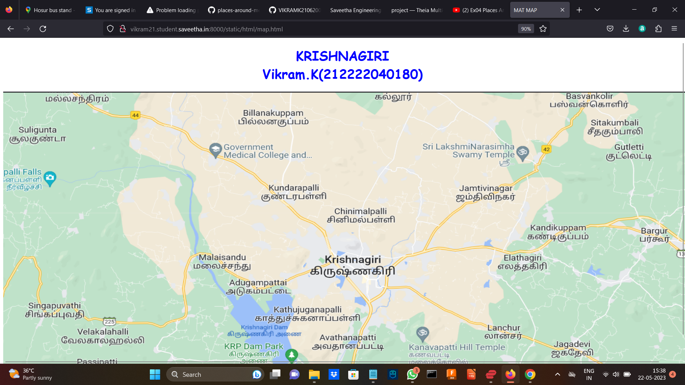
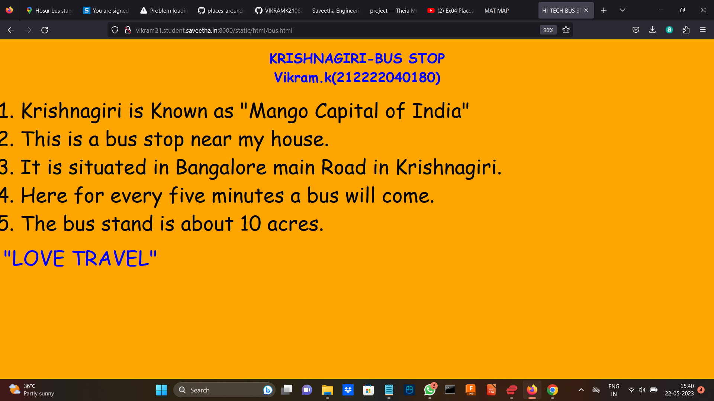
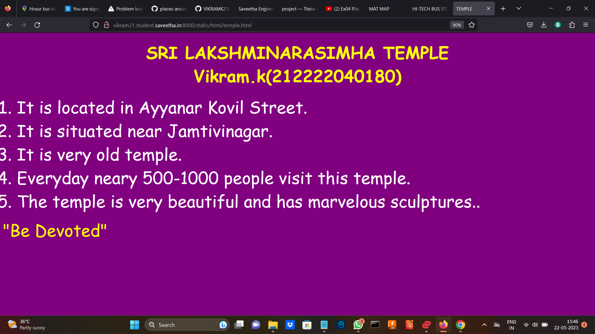
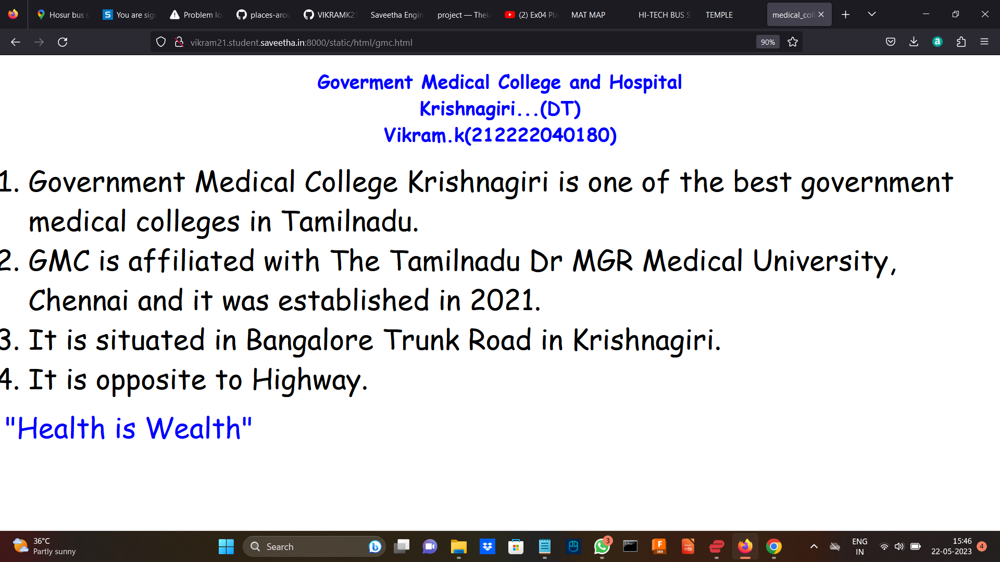
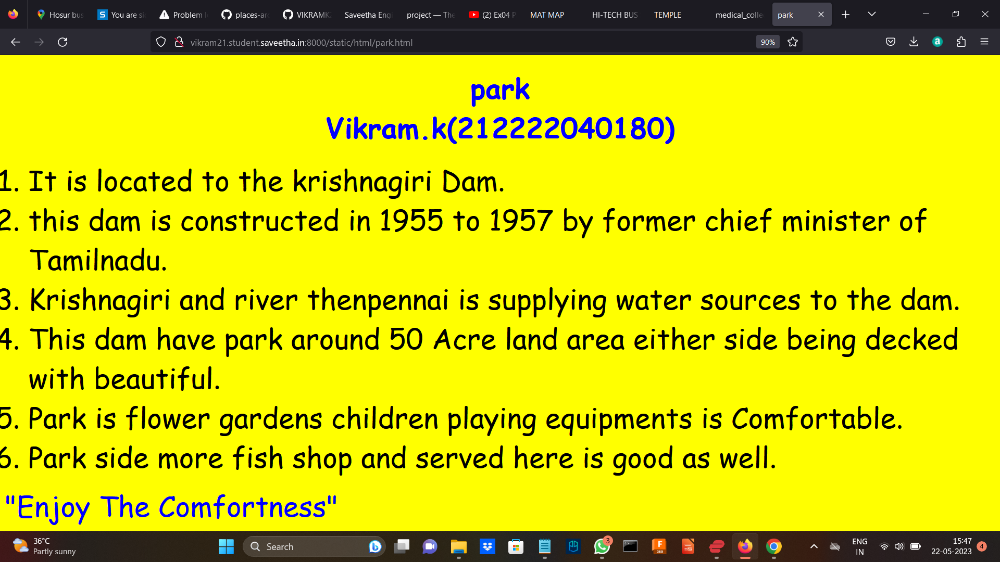
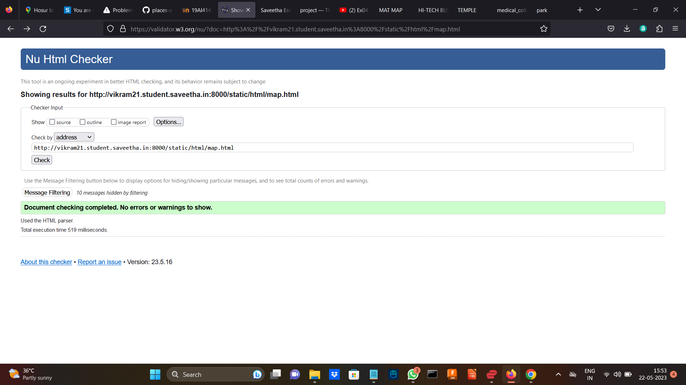

# Ex04 Places Around Me
## AIM
To develop a website to display details about the places around my house.

## DESIGN STEPS

### STEP 1
Clone the github repository into Theia IDE.

### STEP 2
Create a new Django Project.

### STEP 3
Write the needed HTML code.

### STEP 4
Run the Django server and execute the HTML files..

### STEP 5
Write HTML programs for all the regions identified.


## CODE

```
 map.html
 <!DOCTYPE html>
<html lang="en">
    <head>
        <title>MAT MAP</title>
    </head>
    <body>
        <h1 align="center">
    <font color="blue" face="cursive">
        <li>KRISHNAGIRI</li>
        <li>Vikram.K(212222040180)</li>
    </font>
    </h1>
        
        <MAP name="map">
             <AREA shape="RECT" coords="798,616,807,606"
                   href = "/static/html/bus.html/" Title="New Bus Stand" alt>
             <AREA shape="RECT" coords="1168,785,1180,777"
                   href = "/static/html/temple.html/" Title="Sri Varahi Amman Temple" alt>
             <AREA shape="RECT" coords="1004,559,1012,553"
                   href = "/static/html/hotel.html/" Title="Archana Residency" alt>
             <AREA shape="RECT"  coords="909,490,919,486"
                   href = "/static/html/court.html/"   Title="Vpm District Court" alt>
             <AREA shape="RECT"  coords="880,788,877,778"
                   href = "/static/html/biriyani.html/"  Title="Dindigul Thalapakkatti" alt>
         
        </MAP>

    </body>
</html>

bus.html
<!DOCTYPE html>
<html lang="en">
<head>
    <title>
        HI-TECH BUS STOP
    </title>
</head>
<body bgcolor="orange" >
<h1 align="center">
    <font color="blue" face="cursive">
        <li>KRISHNAGIRI-BUS STOP</li>
        <li>Vikram.k(212222040180)</li>
    </font>
</h1>
<p align="center">
    <font color="black" face="Comic Sans MS" size="24">
        <OL  TYPE="1" START="1">
            <LI>Krishnagiri is Known as "Mango Capital of India"</LI>
            <LI> This is a bus stop near my house.<br></LI> 
            <LI>It is situated in Bangalore main Road in Krishnagiri.<br></LI>   
            <LI>Here for every five minutes a bus will come.<br></LI>
            <LI>The bus stand is about 10 acres.<br></LI>

        </OL>
    </font>
    <font color ="blue" face = "cursive" size="16" > 
    "LOVE TRAVEL"
    </font>
</p>
</body>
</html>

temple.html
<!DOCTYPE html>
<html lang="en">
<head>
    <title>
        TEMPLE
    </title>
</head>
<body bgcolor="purple" >
<h1 align="center">
    <font color="yellow" face="cursive" size="30">
        <li>SRI LAKSHMINARASIMHA TEMPLE</li>
        <li>Vikram.k(212222040180)</li>
    </font>
</h1>
<p align="center">
    <font color="white" face="Comic Sans MS" size="24">
        <OL  TYPE="1" START="1">
            <LI>It is located in Ayyanar Kovil Street.<br></LI> 
            <LI>It is situated near Jamtivinagar.<br></LI>   
            <LI>It is very old temple.<br></LI>
            <li>Everyday neary 500-1000 people visit this temple.</li>
            <li>The temple is very beautiful and has marvelous sculptures..</li>
        
            
        </OL>
    </font>
    <font color ="yellow" face = "cursive" size="16" > 
    "Be Devoted"
    </font>
</p>
</body>
</html>

gmc.html
<!DOCTYPE html>
<html lang="en">
<head>
    <title>
        medical_college
    </title>
</head>
<body bgcolor="white" >
<h1 align="center">
    <font color="blue" face="cursive">
        <li>Goverment Medical College and Hospital</li>
        <li>Krishnagiri...(DT)</li>
        <li>Vikram.k(212222040180)</li>
    </font>
</h1>
<p align="center">
    <font color="black" face="Comic Sans MS" size="24">
        <OL  TYPE="1" START="1">
            <LI>Government Medical College Krishnagiri is one of the best government medical colleges in Tamilnadu.<br></LI> 
            <LI>GMC is affiliated with The Tamilnadu Dr MGR Medical University, Chennai and it was established in 2021. </LI>
            <LI>It is situated in Bangalore Trunk Road in Krishnagiri.<br></LI>   
            <LI>It is opposite to Highway.<br></LI>
            
        </OL>
    </font>
    <font color ="blue" face = "cursive" size="16" > 
    "Health is Wealth"
    </font>
</p>
</body>
</html>

park.html
<!DOCTYPE html>
<html lang="en">
<head>
    <title>
      park
    </title>
</head>
<body bgcolor="yellow" >
<h1 align="center">
    <font color="blue" face="cursive" size="30">
        <li>park</li>
        <li>Vikram.k(212222040180)</li>
    </font>
</h1>
<p align="center">
    <font color="black" face="Comic Sans MS" size="24">
        <OL  TYPE="1" START="1">
            <LI>It is located to the krishnagiri Dam.<br></LI> 
            <LI>this dam is constructed in 1955 to 1957 by former chief minister of Tamilnadu.<br></LI>   
            <LI>Krishnagiri and river thenpennai is supplying water sources to the dam.<br></LI>
            <li>This dam have park around 50 Acre land area either side being decked with beautiful.</li>
            <li>Park is flower gardens children playing equipments is Comfortable.</li>
            <li>Park side more fish shop and served here is good as well.</li>
            
        </OL>
    </font>
    <font color ="blue" face = "cursive" size="16" > 
    "Enjoy The Comfortness"
    </font>
</p>
</body>
</html>
```

## OUTPUT











## HTML VALIDATOR



## RESULT
The program for implementing image maps is executed successfully.
